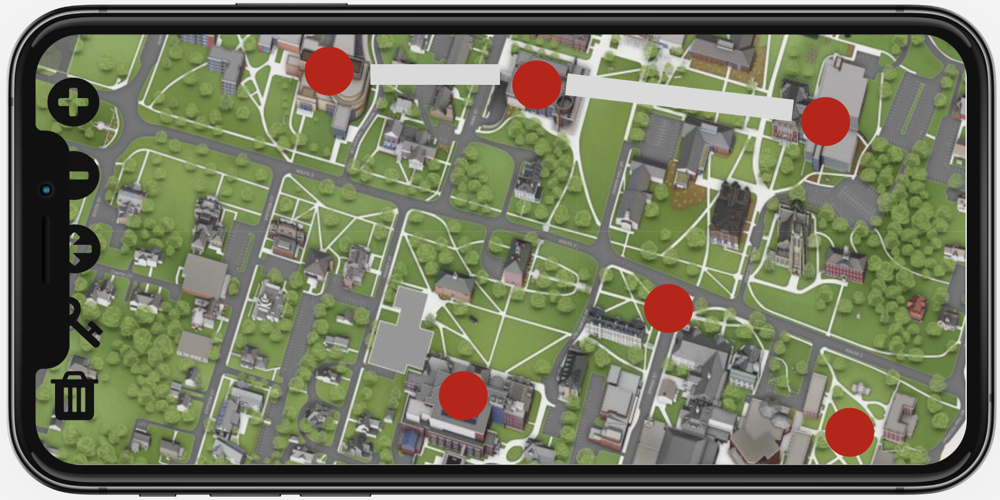

# CS326 Final Project - Ticket To Ride Board Builder

### Group Members: Kaizen Conroy, Dominic Chui

### Overview:

Current status is that the user can add nodes and edges to the graph, and they show up in both the model and view. Underlying model and view are pretty solid. User can upload background image and pan/pinch as they see fit. What doesn't work is that the modelToViewCoordinates isn't translating the pan/pinch correctly. We still need to implement delete and move as part of our basic functionality.

### Vision Statement: 
We plan on building a Ticket To Ride Board Builder (and potentially game engine) by leveraging the software skills we have learned in CS326. Our primary goal is to allow the user to create and save custom Ticket To Ride graphs on our iOS app. A secondary goal is to allow the user to partake in basic TTR gameplay using their custom graph. The primary features include functionality to include photo uploads and allow for users to create graphs by being responsive to touches and dragging. The intended users are TTR afficionados like ourselves who would enjoy playing TTR on custom graphs. We hope for a basic outcome of being able to create new graphs based off of the proportions of an uploaded map.

### Feature List:
  * Allows user to upload an image (map)
  * Access to map of Williams College, map of US, map of NYC/Boston
  * User can create custom TTR graph by adding/deleting nodes and edges 
  * User can zoom/pan around the screen
  * Bonus: Create a basic TTR game engine for 1 player
  * Bonus: Autogenerate destination tickets based off of board

### UI Sketches: 
  
  

### Key Use Cases:

  Case 1: User optionally uploads an image and adds nodes at specific locations. User can create edges between nodes and specify the number of trains fit on each edge. User can save completed board (maybe). User can interact with board by adding trains to connect edges and complete routes. 
  
  Case 2: User starts with a saved board. Can play 1-person version of TTR by playing trains and completing destination tickets. 

### Domain Analysis:

  Ticket To Ride: https://en.wikipedia.org/wiki/Ticket_to_Ride_(board_game)
  
  TTR Game Engine: keeps track of the deck of railway cards, destination tickets, amount of trains left per player.
  

### Architecture:

  Model: Will be based off of our graphADT.
  
  View: User starts off with welcome page giving options to play, build, or upload. Upload options allows for image to be uploaded. Build option allows user to build a new graph either on a blank canvas or over the uploaded image. Here, the user has options to add a node, add an edge, or delete items. They can also save button and go back to welcome page. The play option gives the user a choice of graph to pick, and then allows for gameplay. This is part of our bonus features, not our initial idea. 
  
  Controller: A user will use buttons and click to add a node to the graph, a user drag will add an edge to the graph, using the delete button will delete node/edge from the graph. 
  
  
  

### TODO:

1. ~~Upload images as background (load images out of photo library)~~ 
2. ~~UI to add nodes and edges~~
   - ~~click to add node, click and reclick for edges~~
   - ~~calculate edge weight based on distance~~
   - ~~let user specify color somehow?~~
   - ~~Use GraphADT to store nodes, edges with coordinates~~
3. ~~Zoom and pan~~
4. ~~Add edge colors to model~~ 
   - ~~Add new struct for edge label~~
   - ~~Allow view to show multiple routes on an edge~~
5. Save/load 
6. Allow user to type name for nodes
6. Generate Destination tickets through dijsktras
7. Multiple Views
8. Gameplay?

### Bug To Be Quashed
- Update model edge weights when nodes are moved in view

### Nice Things to Have
- Delete edges in view
- Change edge color in view
- ~~Duplicate edges have scaled distances (not hardcoded)~~
