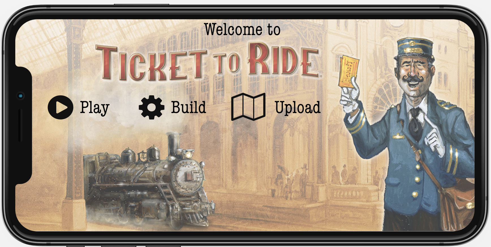

# CS326 Final Project - Ticket To Ride Board Builder

Group Members: Kaizen Conroy, Dominic Chui

Vision Statement: We plan on building a Ticket To Ride Board Builder (and potentially game engine) by leveraging the software skills we have learned in CS326. Our primary goal is to allow the user to create and save custom Ticket To Ride graphs on our iOS app. A secondary goal is to allow the user to partake in basic TTR gameplay using their custom graph. The primary features include functionality to include photo uploads and allow for users to create graphs by being responsive to touches and dragging. The intended users are TTR afficionados like ourselves who would enjoy playing TTR on custom graphs. We hope for a basic outcome of being able to create new graphs based off of the proportions of an uploaded map.

Feature List:
  * Allows user to upload an image (map)
  * Access to map of Williams College, map of US, map of NYC/Boston
  * User can create custom TTR graph by adding/deleting nodes and edges 
  * User can zoom/pan around the screen
  * Bonus: Create a basic TTR game engine for 1 player
  * Bonus: Autogenerate destination tickets based off of board

UI Sketches: 
  * 
  * 

Key Use Cases:
  Case 1: User optionally uploads an image and adds nodes at specific locations. User can create edges between nodes and specify the number of trains fit on each edge. User can save completed board (maybe). User can interact with board by adding trains to connect edges and complete routes. 
  Case 2: User starts with a saved board. Can play 1-person version of TTR by playing trains and completing destination tickets. 

Domain Analysis:
  Ticket To Ride: link to wiki article

Architecture:
  Model: Will be based off of our graphADT. 
  View: User can click a location to place a node, or drag between nodes to create an edge, or click a button to delete items. Also will have save button and load button. 
  Controller: A user click will add a node to the graph, a user drag will add an edge to the graph, using the delete button will delete node/edge from the graph. 
  
  
  We can use a Dictionary to represent cards We will have a number to represent amount of trains and a list to represent 
  
